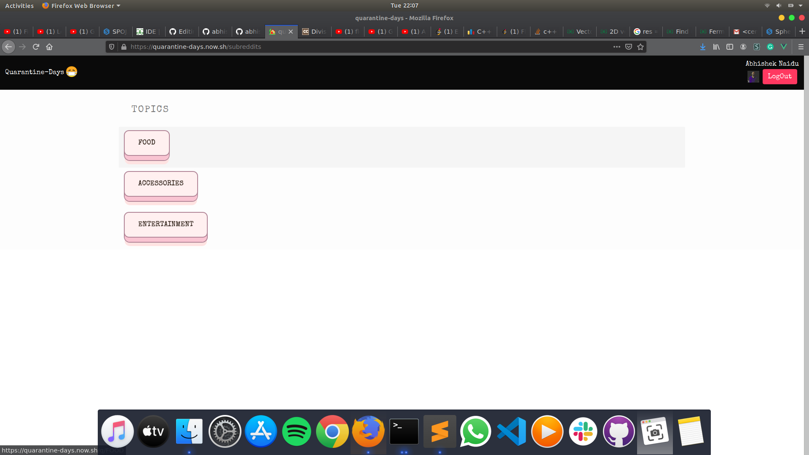
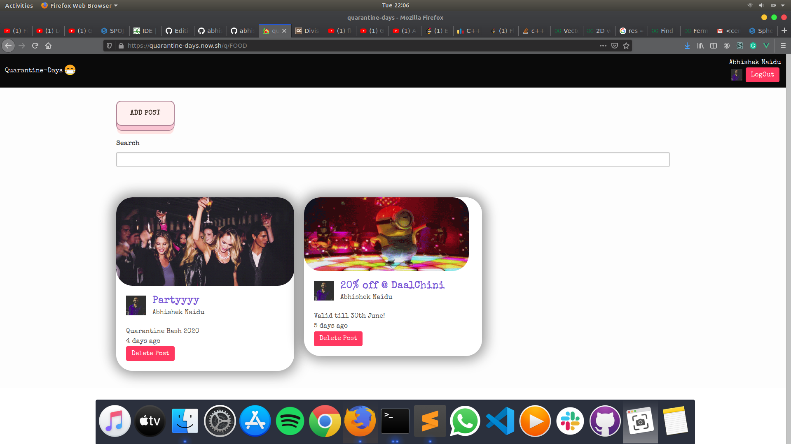
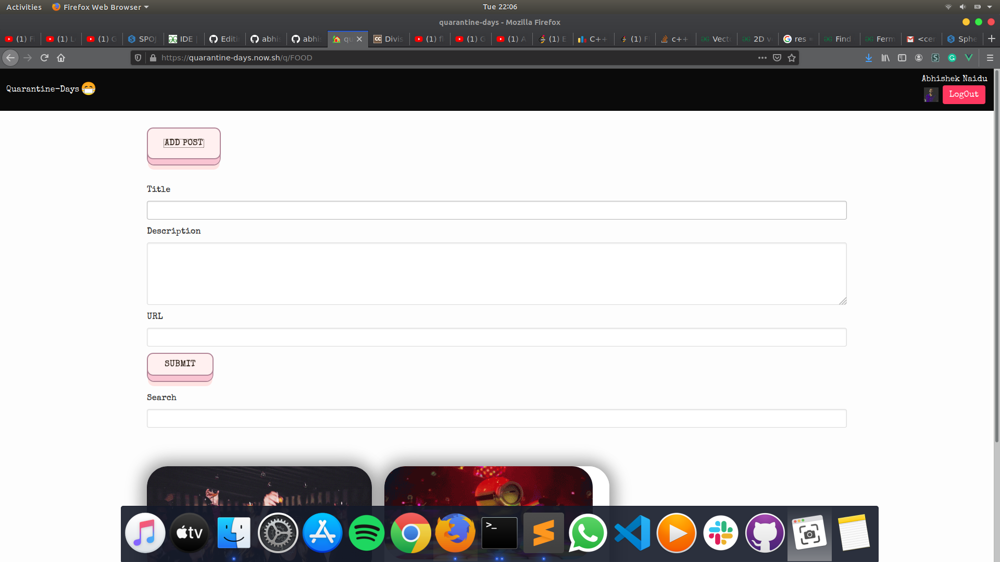

# Quarantine Days

### A Vue-based Web Interface, Built during Quarantine Days

Check it out at https://quarantine-days.now.sh/

### Tech Stack : 


### Dependencies :

*  `vue: ^2.6.11`
*  `vue-router: ^3.1.6`
*  `vuex: ^3.1.3`
*  `vuexfire: ^3.2.2`
*  `@buefy: ^0.8.16`
*  `@core-js: ^3.6.4`
*  `eslint-loader: ^4.0.0`
*  `firebase: ^7.14.2`
*  `now: ^18.0.0`
*  `pattern.css: ^1.0.0`
  
### Screenshots :

```diff
+ HOME PAGE :

```




```diff
+ SUB-TOPIC PAGE :

```




```diff
+ ADD POST PAGE :

```




## Project setup
```
npm install
```

### Compiles and hot-reloads for development
```
npm run serve
```

### Compiles and minifies for production
```
npm run build
```

### Run your unit tests
```
npm run test:unit
```

### Run your end-to-end tests
```
npm run test:e2e
```

### Lints and fixes files
```
npm run lint
```

### Customize configuration
See [Configuration Reference](https://cli.vuejs.org/config/).
